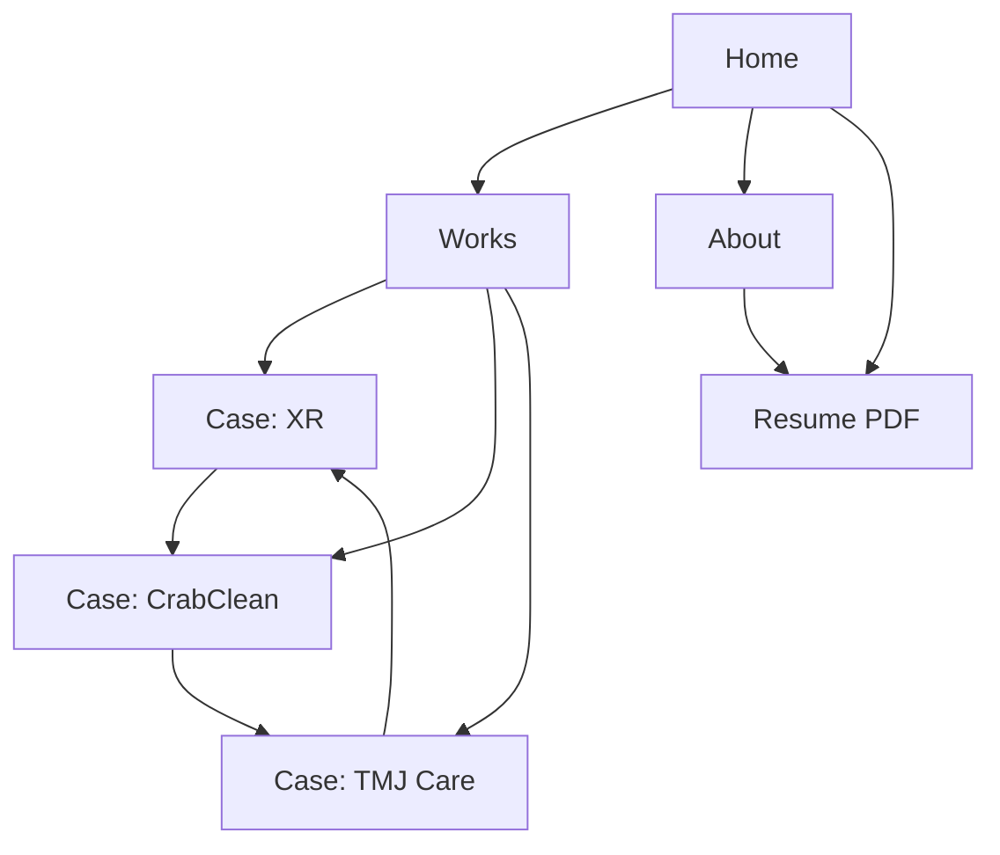
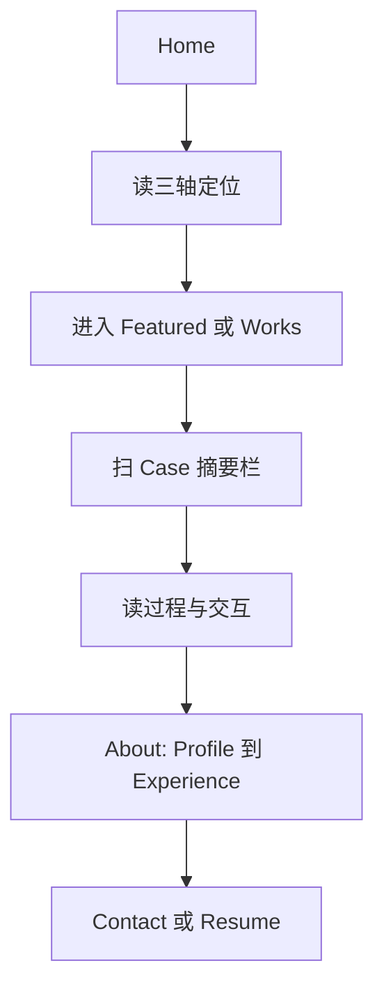

# Information Architecture（IA）

> 个人作品集网站信息架构。依据 [website-brief.md](./website-brief.md) 制定。本阶段只定义结构与内容模块，不涉及视觉与开发。

**当前确认决策：**

- 一级导航：`Home` · `Works` · `About` · `Resume`
- About 与 Contact：**合并**（Contact 为 About 页内模块）
- About 页面模块：Personal Profile · Education · Skills · Experience · Contact
- 语言：中文为主；导航可用英文标签（与你指定一致）；预留英文切换（后期）
- 作品列表顺序：**待定**（见 Brief 方案 A / B / C，选定后再写入）

---

## 1. 站点地图（Sitemap）

```text
/
├── /works
│   ├── /works/hikvision-xr      （中电海康 XR）
│   ├── /works/crabclean         （CrabClean）
│   └── /works/tmj-care          （TMJ Care）
├── /about
│   ├── #profile                 （Personal Profile）
│   ├── #education               （Education）
│   ├── #skills                  （Skills）
│   ├── #experience              （Experience）
│   └── #contact                 （Contact）
└── /resume.pdf                  （Resume 下载）
```

路径使用 `/works`（与导航 Works 一致），不再使用 `/work`。

### 页面关系



Case 之间的「上一个 / 下一个」顺序随最终主推方案变化（见第 3.C 节）。

---

## 2. 导航结构

### 一级导航（已确认）

| 标签 | 目标 | 说明 |
|------|------|------|
| **Home** | `/` | Logo / 姓名亦可回首页 |
| **Works** | `/works` | 作品列表 |
| **About** | `/about` | 含 Profile → Contact 全模块 |
| **Resume** | `/resume.pdf` | 新标签打开或直接下载；可做成按钮样式 |

不设独立一级导航「Contact」。联系信息在 About 末模块 + 全站页脚。

### 页脚（全站）

- 邮箱（链到 `mailto:` 或 `/about#contact`）
- 社交链接（按实际填写）
- 姓名 / 简短版权

---

## 3. 页面级信息架构

### A. Home `/`

**目标：** 10 秒建立认知，30 秒进入 Works。

| 顺序 | 区块 | 内容 | 说明 |
|------|------|------|------|
| 1 | Hero | 姓名 + 三轴标签（Industrial Design · UX/UI · Intelligent Product Design）+ 一句话定位 + 主 CTA（View Works）+ 次 CTA（Resume） | 与 Brief 定位一致 |
| 2 | Featured Works | 2–3 个项目大卡 | **顺序 = 最终选定方案**；未定前可先按占位排列 |
| 3 | Capability Snapshot | 3–5 个短句 / 关键词 | 对应 Brief 能力轴 |
| 4 | About teaser | 2–3 句 + 链到 `/about` | |
| 5 | Footer | 邮箱、社交 | |

**不做：** 首屏时间线、技能进度条、堆砌统计数字。

**精选卡片字段：** 封面、项目名、一句话、类型标签（ID / UX·UI / Intelligent Product / XR / Medical 等）。

---

### B. Works `/works`

**目标：** 快速比较项目，进入 Case Study。

| 元素 | 说明 |
|------|------|
| 页标题 | Works |
| 可选标签展示 | All · UX/UI · Intelligent Product · Industrial Design · Medical 等（项目少时用标签即可，不必做复杂筛选） |
| 项目列表 | **顺序待 Brief 方案选定后定稿** |

**卡片字段：**

- 封面图
- 项目名
- 一句话（解决什么问题）
- 角色（调研 / 交互 / 外观 / 原型等）
- 类型标签
- 时间 / 周期（可选）

#### 列表顺序对照（选定后启用其一）

| 方案 | 列表顺序（1 → 3） |
|------|-------------------|
| **A 交互优先** | XR → CrabClean → TMJ Care |
| **B 智能产品平衡** | CrabClean → XR → TMJ Care |
| **C 研究共情先行** | TMJ Care → XR → CrabClean |

首页 Featured Works 必须与此表一致。

---

### C. Case Study `/works/[project]`

三案共用模板，阅读节奏可预期。

#### 统一模块顺序

| 顺序 | 模块 | 内容要点 |
|------|------|----------|
| 1 | **摘要栏（首屏）** | 项目名、一句话、角色、周期、团队、工具、标签、可选成果要点 |
| 2 | **Overview** | 背景、目标用户、问题 |
| 3 | **My Role** | 具体贡献 |
| 4 | **Research** | 方法、发现、洞察 |
| 5 | **Process** | 发散 → 收敛 → 关键（含取舍） |
| 6 | **Experience** | 旅程、流程 / IA、关键交互与数字触点 |
| 7 | **Solution** | 产品 / 界面 / 场景终稿视觉 |
| 8 | **Outcome & Reflection** | 验证、反馈、反思 |
| 9 | **Next project** | 上一个 / 下一个 |

#### 各项目侧重（模板相同，加粗不同）

| 项目 | 路径 | 加重模块 | 叙事重点 |
|------|------|----------|----------|
| 中电海康 XR | `/works/hikvision-xr` | Experience | 多模态、空间交互、软硬流程、界面 |
| CrabClean | `/works/crabclean` | Overview / Process / Experience | 系统场景、智能策略、人机使用 |
| TMJ Care | `/works/tmj-care` | Research / Experience | 研究、旅程、医疗约束下的体验决策 |

#### 项目间导航顺序（随方案变化）

| 方案 | 循环顺序 |
|------|----------|
| A | XR ⇄ CrabClean ⇄ TMJ Care |
| B | CrabClean ⇄ XR ⇄ TMJ Care |
| C | TMJ Care ⇄ XR ⇄ CrabClean |

---

### D. About `/about`（已确认结构）

**目标：** 建立信任、说明背景与求职意向、完成联系转化。  
**原则：** 单一页面、分区清晰；可用页内锚点跳转。

| 顺序 | 模块 ID | 模块名 | 内容要点 |
|------|---------|--------|----------|
| 1 | `#profile` | **Personal Profile** | 简短自我介绍、设计方向三轴、求职意向（互联网 / UX / 交互等） |
| 2 | `#education` | **Education** | 学校、专业、学历、关键时间；可选导师 / 研究方向一句话 |
| 3 | `#skills` | **Skills** | 按类分组：Research / UX·UI / Industrial Design / Intelligent Product / Tools（如实填写） |
| 4 | `#experience` | **Experience** | 实习、项目、竞赛等时间线（精简；与 Works 深度案例不重复堆砌） |
| 5 | `#contact` | **Contact** | 邮箱（主）、可选社交链接、目前状态一句话；可再放 Resume 按钮 |

**目前状态文案示例：**

> 正在寻求互联网 / UX / 交互设计相关实习或校招机会。

**不做：** 将 Contact 拆成独立一级页面；Skills 使用虚假百分比进度条（若展示技能，用分组标签或短列表即可）。

---

## 4. 用户流量路径



1. Home 确认匹配度（三轴 + 一句话）
2. 进入排序第一的 Case，扫摘要
3. 有兴趣则精读 Experience / Research
4. About 建立信任 → Resume / Contact

---

## 5. IA 原则

1. **结论先行** — 每页、每案开头先给判断信息
2. **深度优于数量** — 先做透将选定为前两位的 Case
3. **三轴可扫描** — 标签与职责写清 ID / UX·UI / Intelligent Product 贡献
4. **模块可复用** — 三案同一骨架
5. **联系可达** — About#contact + 页脚；Resume 在一级导航固定入口
6. **顺序可配置** — 列表与首页 Featured 随 Brief 方案切换，不写死唯一顺序直至你确认

---

## 6. 内容清单（供后续填文案 / 素材）

### 全站

- [ ] 姓名与一句话定位定稿
- [ ] 选定作品排序方案（A / B / C 或自定义）
- [ ] Resume PDF
- [ ] 邮箱与社交链接
- [ ] 求职状态一句话

### About 各模块

- [ ] Personal Profile 正文
- [ ] Education 条目
- [ ] Skills 分组列表
- [ ] Experience 时间线
- [ ] Contact 信息

### 每个 Case Study

- [ ] 封面与关键视觉
- [ ] 摘要栏字段
- [ ] Overview → Reflection 全文案
- [ ] 流程 / 旅程 / 交互示意

---

## 7. 本阶段范围

**已定义：** 站点地图、一级导航（Home / Works / About / Resume）、About 五模块、Case 模板、三套作品排序对照表

**待你确认后更新：** 最终作品展示顺序及首页 / Works / Case 前后导航

**不做：** 视觉风格、线框细节、前端开发

**建议下一步：** 选定排序方案 → 更新 Brief/IA 终稿顺序 → 视觉方向或 Case 文案填充
